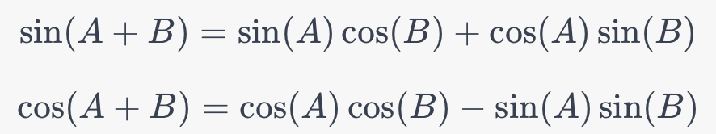

```python
def sinusoidal_init(seq_len, dim):
    position = torch.arange(seq_len).unsqueeze(1)
    div_term = torch.exp(torch.arange(0., dim, 2) * -(math.log(10000.0) / dim))
    pos_emb = position * div_term
    pos_emb[:, 0::2] = torch.sin(pos_emb[:, 0::2])
    pos_emb[:, 1::2] = torch.cos(pos_emb[:, 1::2])
    return pos_emb
```

### Intuition Behind Sinusoidal Initialization:
The idea behind sinusoidal positional encodings is to give the model some information about the relative or absolute position of the tokens in the sequence. The sinusoidal form is chosen because it can allow the model to easily learn to attend to relative positions, as these functions allow the model to easily learn to shift positions.

### Explanation of the Function:

- `torch.arange(seq_len).unsqueeze(1)`: Creates a tensor representing the positions `[0, 1, ..., seq_len-1]` and adds an additional dimension to make it a column vector.

- `torch.exp(torch.arange(0., dim, 2) * -(math.log(10000.0) / dim))`: Calculates the `div_term` for dimension scaling. The division by `log(10000.0)/dim` makes it so that the higher the dimension, the smaller the term.  Note that math.log uses the natural logarithm.

- `position * div_term`: Multiplies the position by the `div_term`, effectively scaling the positional encoding.

- `pos_emb[:, 0::2] = torch.sin(pos_emb[:, 0::2])` and `pos_emb[:, 1::2] = torch.cos(pos_emb[:, 1::2])`: These lines apply the sine function to even indices and the cosine function to odd indices of the `pos_emb`.

By using both sine and cosine functions, the model can distinguish between different positions more easily and learn relative positional patterns.

The sinusoidal functions (sine and cosine) have properties that make them well-suited for encoding positional information:

1. **[Periodicity](periodicity_and_generalization/README.md)**: Both sine and cosine are periodic functions. This periodicity can allow the model to generalize better to sequence lengths that it hasn't seen during training.

2. **[Orthogonality](orthogonal/README.md)**: Sine and cosine functions are orthogonal over an interval, allowing different positions to generate distinct and uncorrelated embeddings. This orthogonality can help the model distinguish between different positions.

3. **[Linear Transformations](linear_transformations/README.md)**: One attractive property of sine and cosine functions is that they can be recovered through linear transformations. Specifically, any offset \( k \) applied to a sine or cosine wave can be represented as a linear function of the original sine and cosine. This helps the model to easily learn relative positions.



4. **[Smoothness](smoothness/README.md)**: These functions are smooth and differentiable, making them well-suited for backpropagation in neural networks.

By using both sine and cosine, the model has two different 'channels' to capture positional information, which allows it to better learn the dependencies between different positions in the input sequence.
