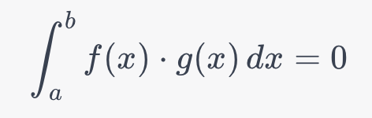

Certainly! The orthogonality of sine and cosine functions can be demonstrated by showing that their dot product over an interval is zero (or close to zero due to numerical approximations).

In mathematical terms, two functions `f(x)` and `g(x)` are orthogonal over an interval `[a, b]` if their dot product is zero:



Here's some PyTorch code to demonstrate this concept:

```python
import torch

# Create a tensor for the interval [0, 2π]
x = torch.linspace(0, 2 * 3.14159, 1000)

# Generate sine and cosine waves
sin_x = torch.sin(x)
cos_x = torch.cos(x)

# Compute their dot product
dot_product = torch.dot(sin_x, cos_x) / len(x)  # Averaging to approximate integration

print(f"The dot product is: {dot_product.item()}")

# Check if it's close to zero
if torch.isclose(dot_product, torch.tensor(0.0), atol=1e-6):
    print("Sine and cosine functions are orthogonal over the interval [0, 2π].")
else:
    print("Sine and cosine functions are not orthogonal over the interval [0, 2π].")
```

The dot product should be close to zero, confirming that the sine and cosine functions are orthogonal over the interval \( [0, 2\pi] \). This orthogonality helps in creating distinct positional embeddings for the transformer models.